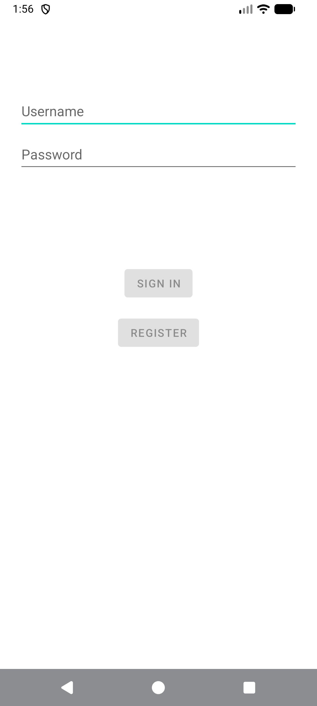
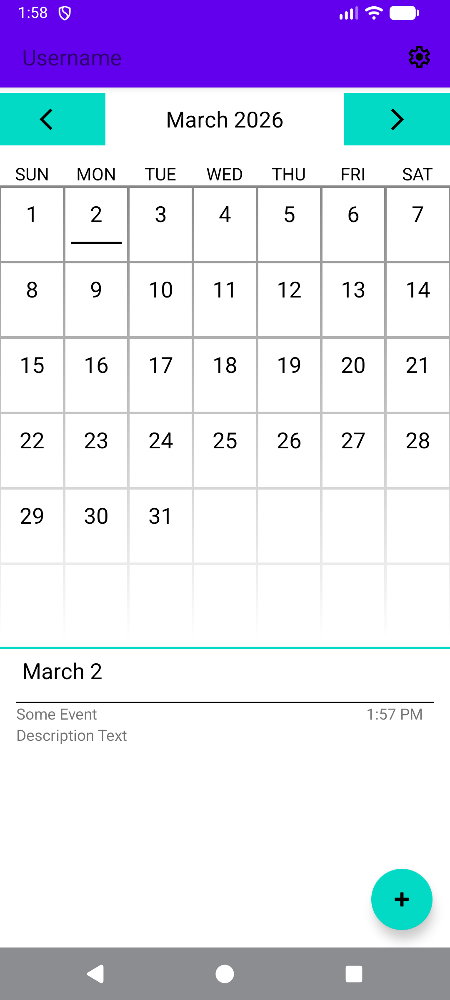
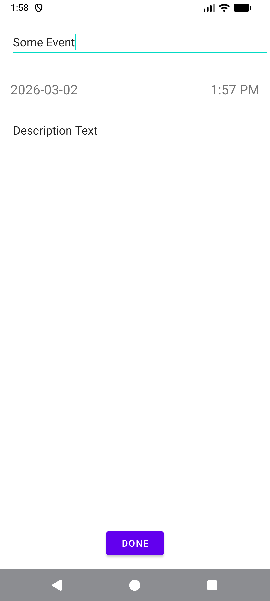
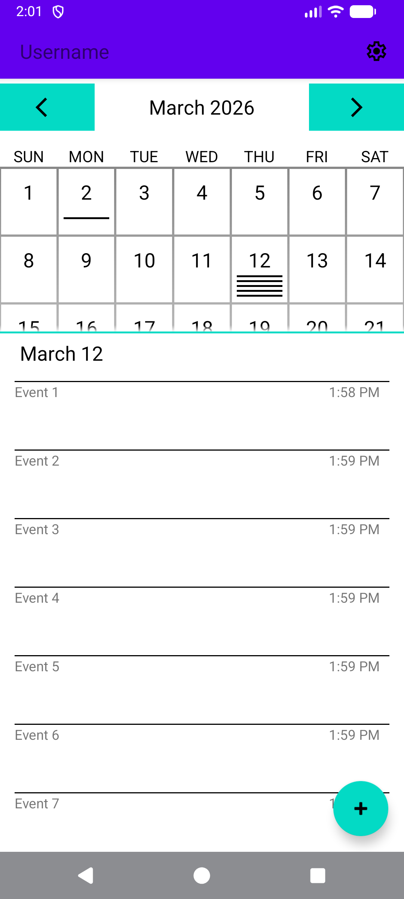
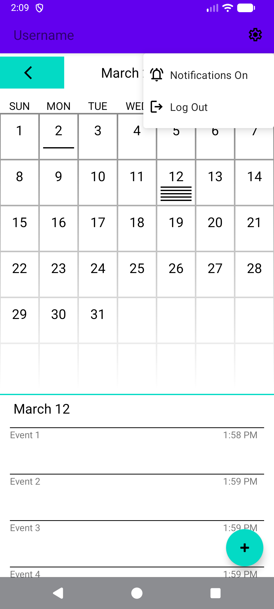

# App Requirements
Event-Tracking App: \
This application will be used to track the dates and times of upcoming events. This application must include the following features:
- A database with at least two tables, one to store the event details and one to store user logins and passwords
- A screen for logging into the app
  - Note that the screen for logging into the app should also be used to create a login if the user has never logged in before.
- A screen with a grid , that displays all upcoming events
- A mechanism by which the user can add and remove events from the database
- A mechanism by which the user can enter the time and general information of a specific event
- A mechanism by which the application will notify the user on the day that an event has been scheduled

# About Development
First I looked to other apps that accomplish similar goals for inspiration. From there I designed the UI to display as much useful information as possible without making it overly crowded for the main screen that users would be using, the calendar. Then I put together the other screens that were needed for the app, the login and the event editing screens. Once the UI was in place I began developing the code to make it work. This involved trial and error as this is a new environment for me. Along the way I also had to add in more supporting UI elements such as the top app bar and the menu to log out and enable notifications. Testing was done using Android Studio's emulator and debugger. I would interact with all elements and simulate actions users would take such as adding events or creating a new log in. 

# Screenshots
*Login Screen*

*Main Calender*

*Event Creation/Edit*

*Calender With Events List Pulled Up*

*Setting Menu*

