# CS-465 Fullstack Development with MEAN

In this class I took a vacation booking website from using just HTML and CSS to the MEAN stack. I also implemented an admin portal which allowed for modification of the database to add, remove, and edit the trips listed on the site.

This was done with: MongoDB, Express.js, Angular.js, Node.js, Mongoose, Handlebars, Postman, and DBeaver.

All this resulted in a website that is more suited to a client/server environment, easier to maintain due to the use of templates and routing, and supports editing without the need for changes in code through the use of the admin portal.

The biggest challenge I face during this project was getting the correct Node and Node package versions so that things could build and work together. After some research plus trial and error I was able to find the correct configuration of versions for everything to work together. The core of the problem came down to having to use older versions of things due to changes in the different parts that relied on depreciated functionality in new versions of Node. 

*Main Page*
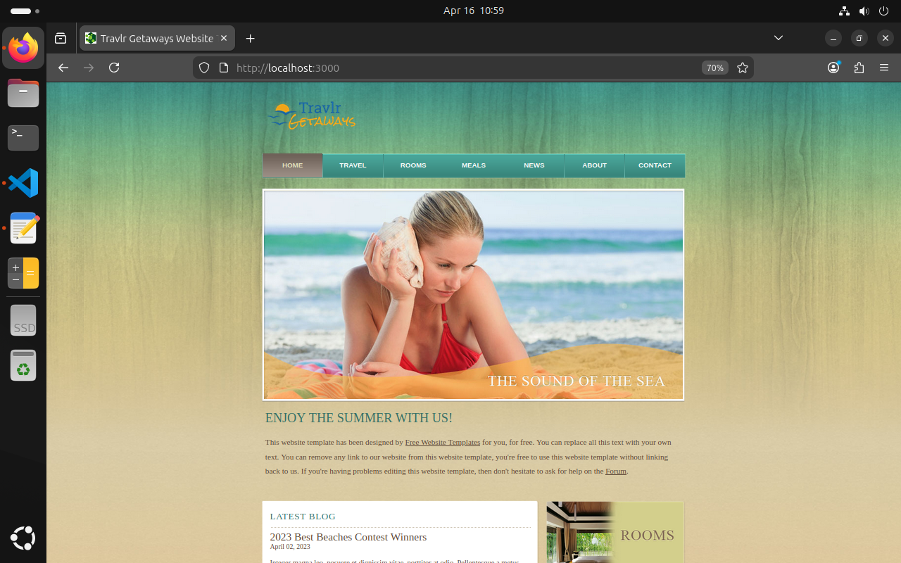

*Main Page running from terminal after one connection*
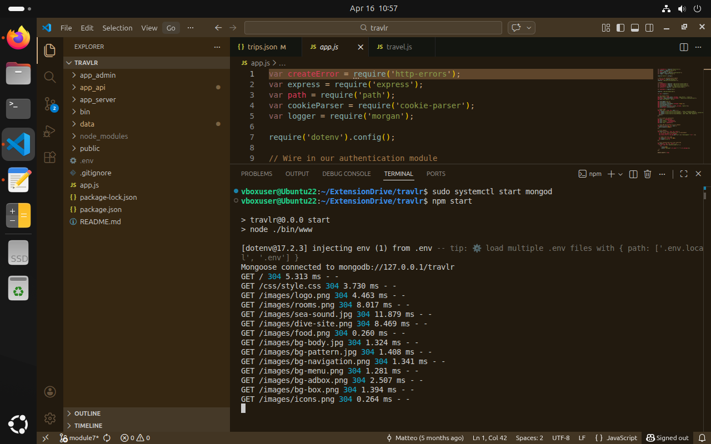

*Trip Page*
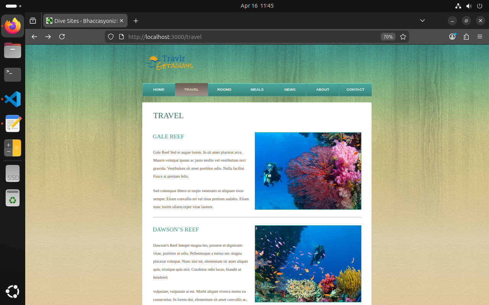

*Trip Page running from terminal after one connection*
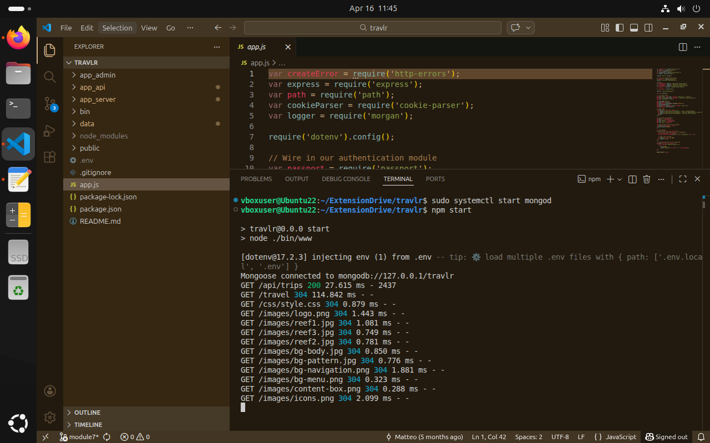

*Admin Portal*
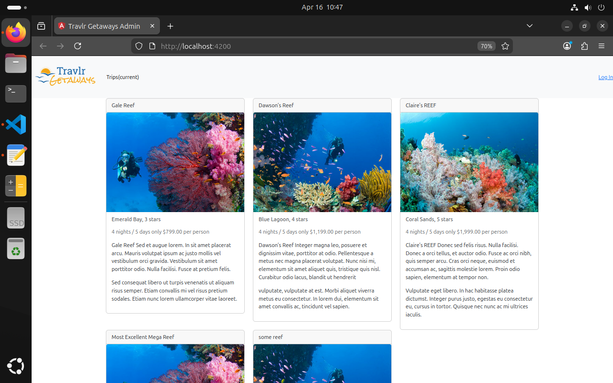

*Admin Portal login*
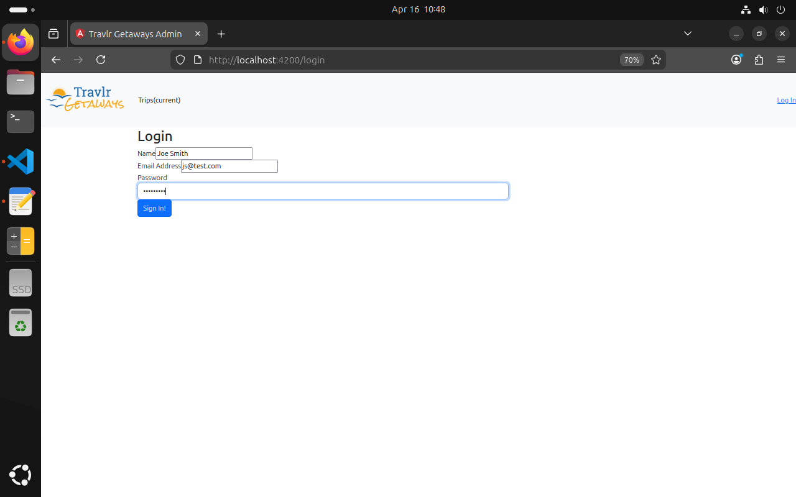

*Admin Portal after login*
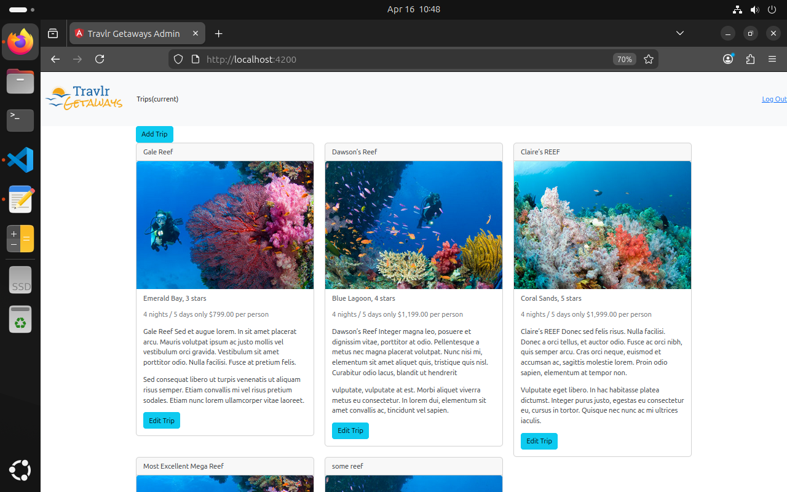

*Admin Portal edit trip*
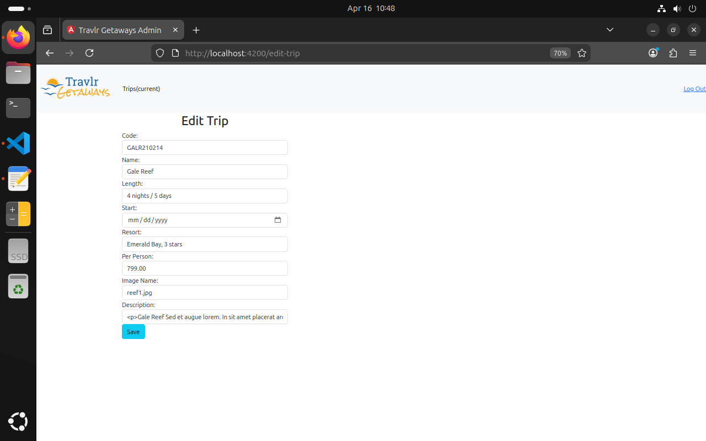

*Admin Portal from terminal*
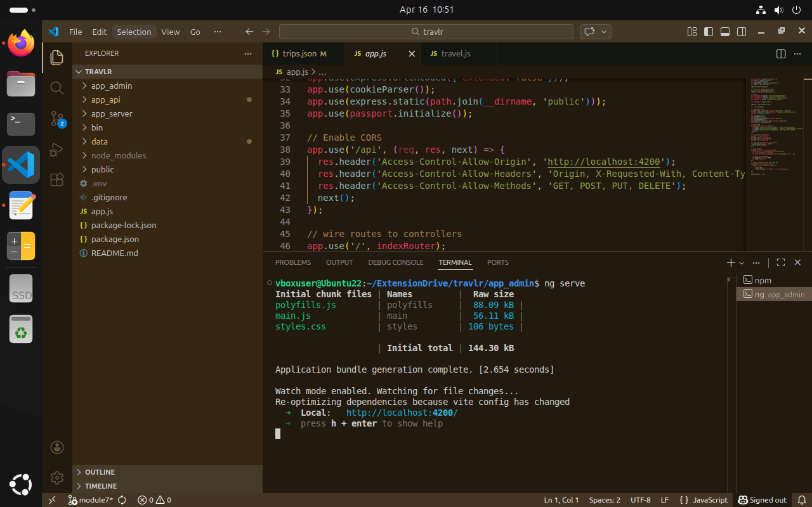

*DBeaver displaying database*
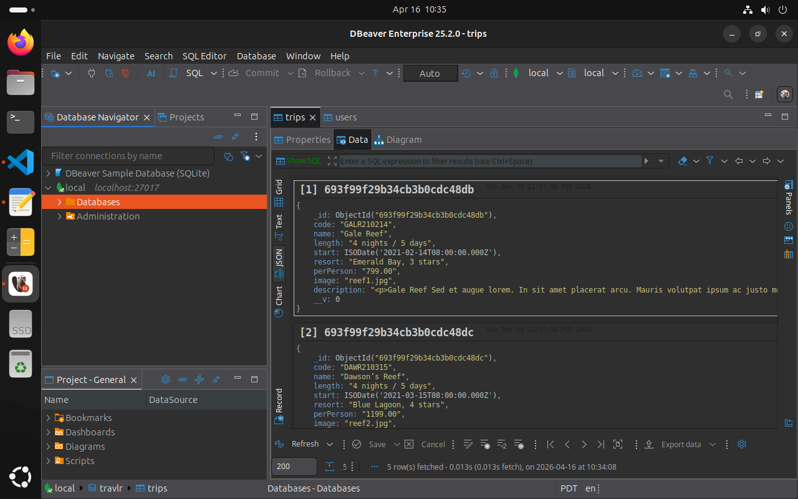

*Postman registering admin to admin database*
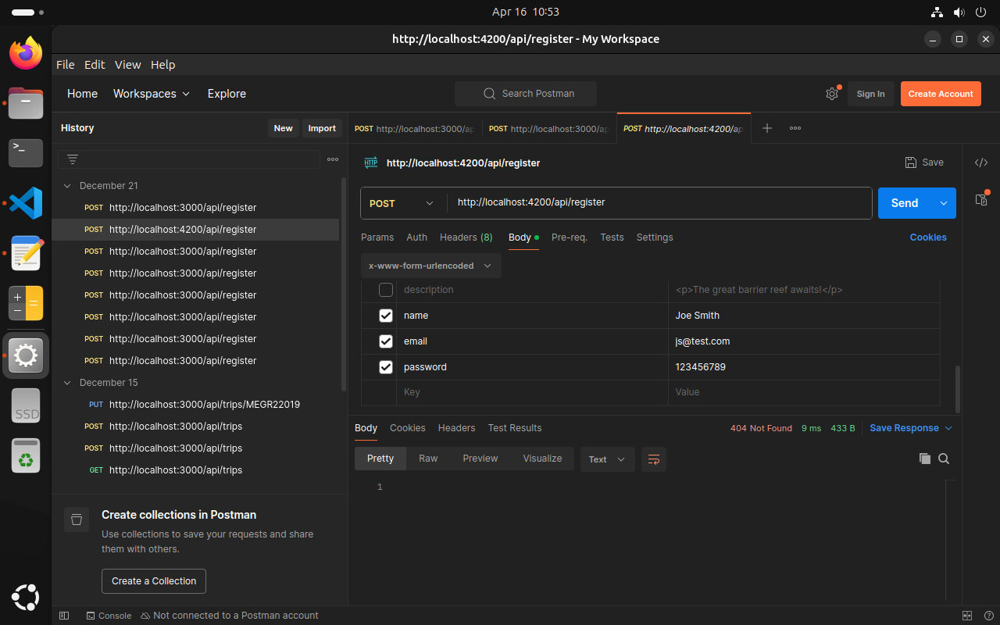
