# Full Stack Development

Throughout this course I learned how to take a static website, containerize it with Docker, then port it to the cloud with AWS.

https://github.com/user-attachments/assets/98f1ff66-5934-443a-bc4a-88f2f4e0dfd9

## Containerization 
I started with the Angular QA Template, which used the MEAN stack to set up a locally hosted website. \
https://github.com/AngularTemplates/learn-angular-from-scratch-step-by-step \
https://github.com/AngularTemplates/learn-how-to-build-a-mean-stack-application

From this starting point I separated out the components of the website to three main parts (frontend, backend, and database). Once separated I placed each in their own container using Docker Desktop and connected the backend and database containers using Docker Compose. 

*Building frontend and backend for Docker*
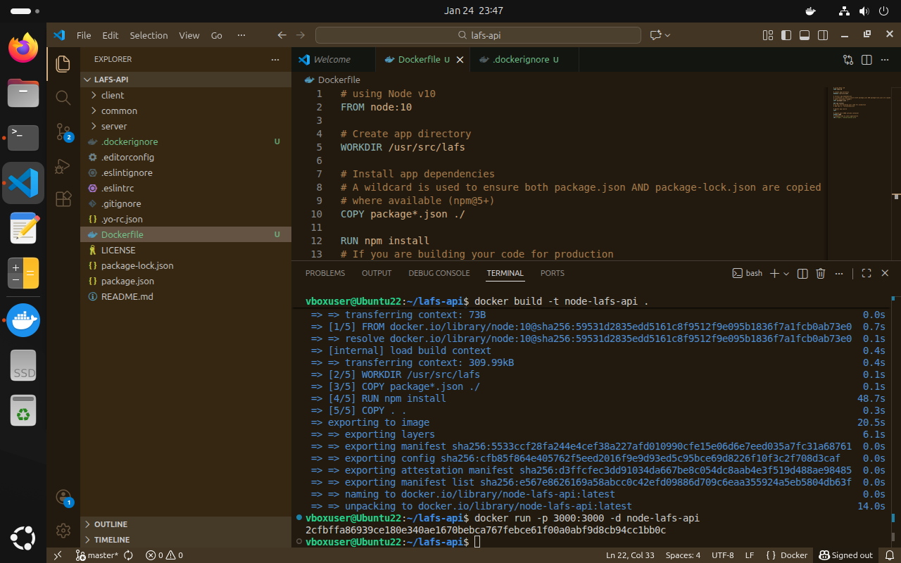
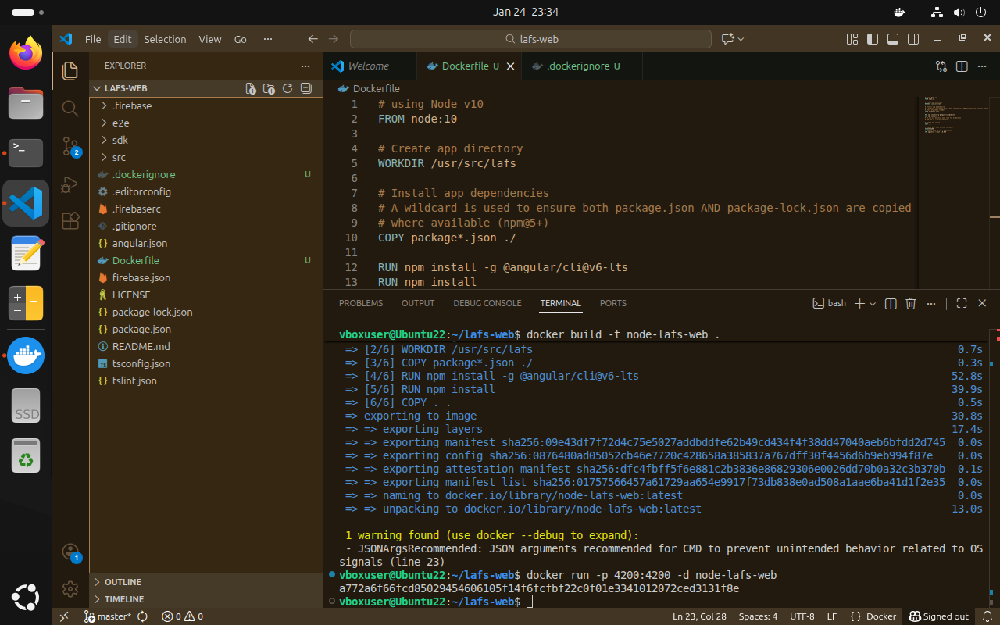

*Containerized MongoDB*
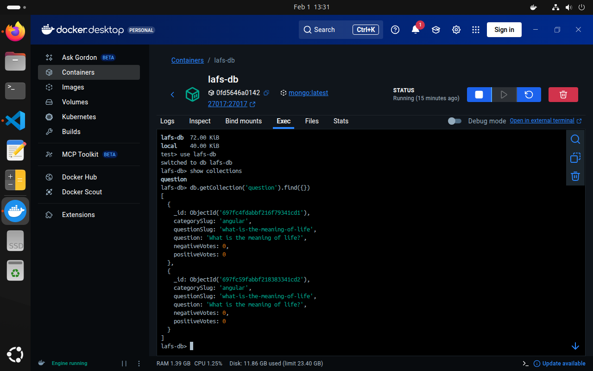

*Docker Network*
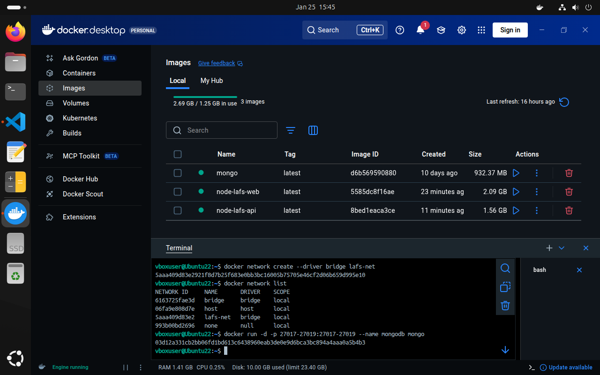

*Docker Compose*
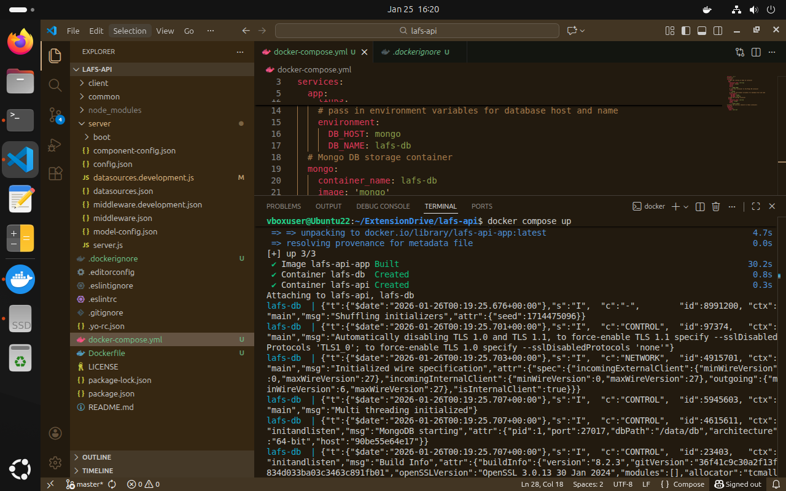

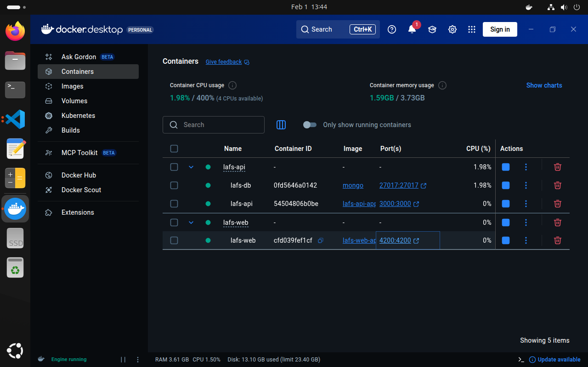

*Testing API*
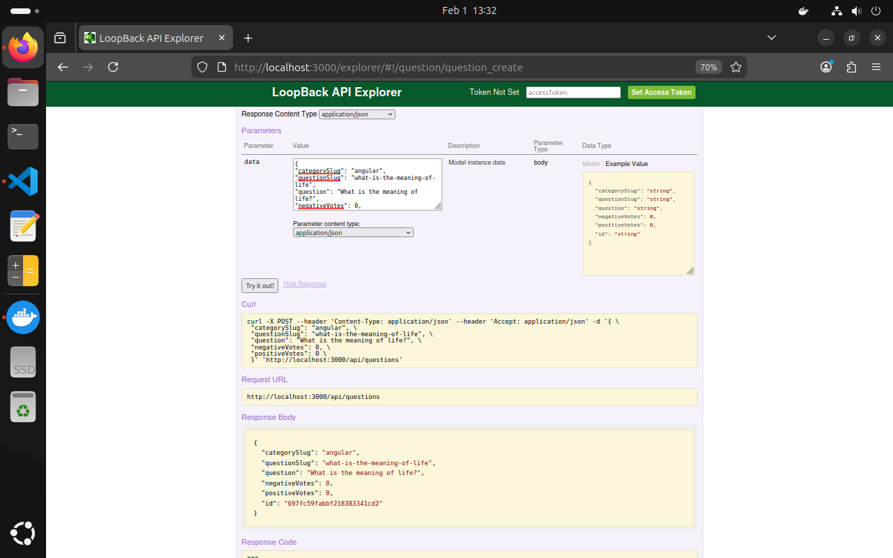

This keeps the components separated in their own environments, which increase the modularity and maintainability of the system, while still allowing the backend to freely communicate with the database due to the network.

Once this worked I began porting the site to the cloud with AWS. 
- S3 hosted the site
- DynamoDB was the new database
- Lambda held the implemented functions for the API
- API Gateway connected the frontend to the backend

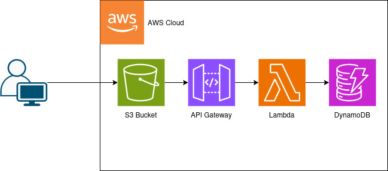

## S3
Before uploading the site to S3 I used Angular to build the site for deployment. Once that was done I uploaded the frontend files. After this I made the site public by disabling the public access block and adding a bucket policy that allowed for read and get access. These two steps were necessary since S3 is defaultly private and has two layers of protection.

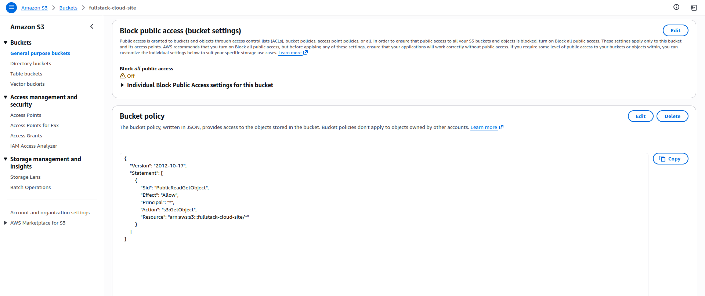

## DynamoDB
Originally the site used MongoDB as the database, but since the database had yet to be used I switched to DynamoDB since it is specialized for the AWS environment and the change would have no impact on the site. I created two tables, one for questions and one for answers, 

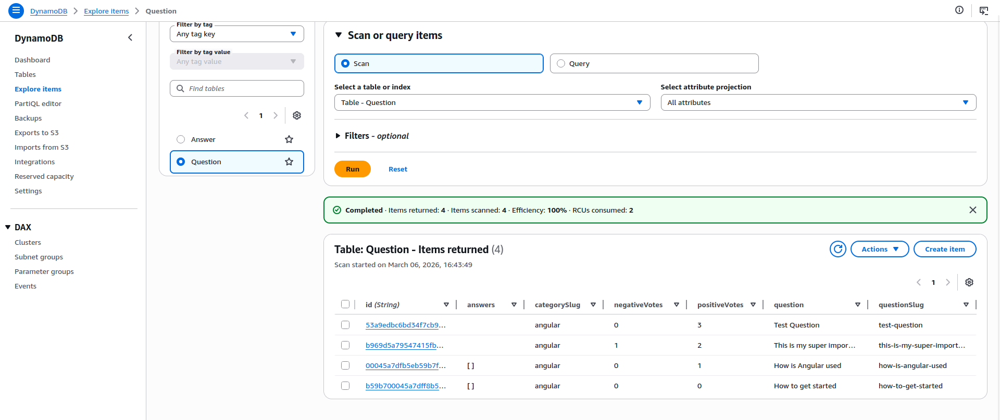
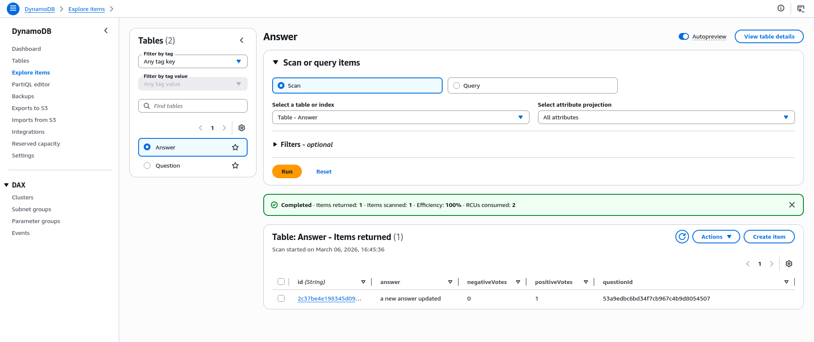

## Lambda
Lambda holds all the functions for interaction with the database. Here I implemented functions for creating, reading, updating, and deleting elements within the two databases. I also tied each function to a role which increases security by only allowing users with that role to use those functions.

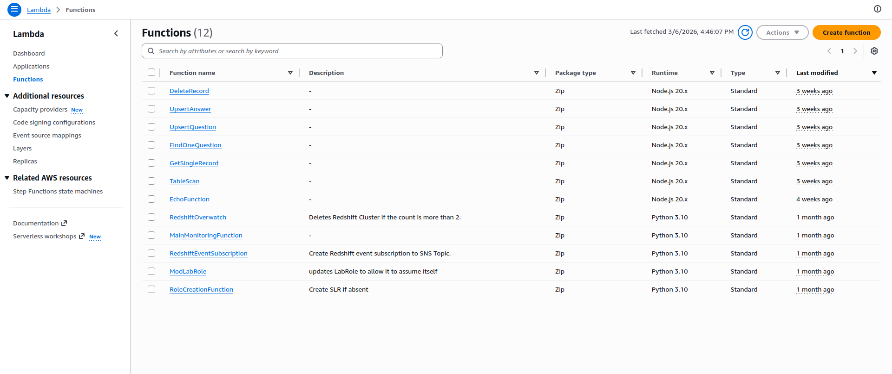

In Lambda I also created test events for each function to ensure they worked.

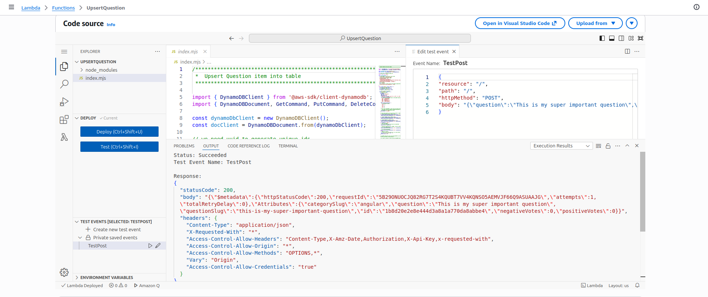

## API Gateway
In order to tie the frontend to the database I used API Gateway to give the frontend an access point where it could make REST requests from to interact with the database.

Since this is the public entry point for communication with the database I enabled the latest Security Policy LTS, which would restrict actions of clients interacting with the API.

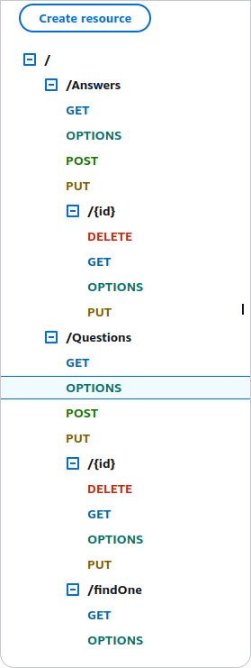

Each request was tied to a lambda function which would allow users to interact with the database.

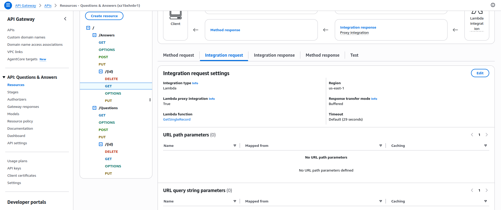

To support CORS I added the OPTIONS method to each resource with the necessary headers and response headers to allow CORS.

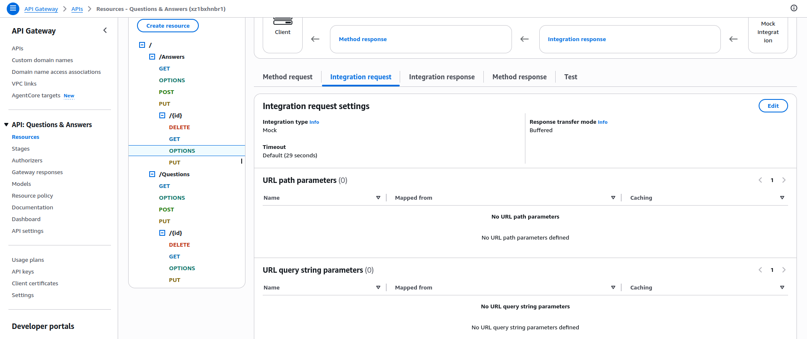
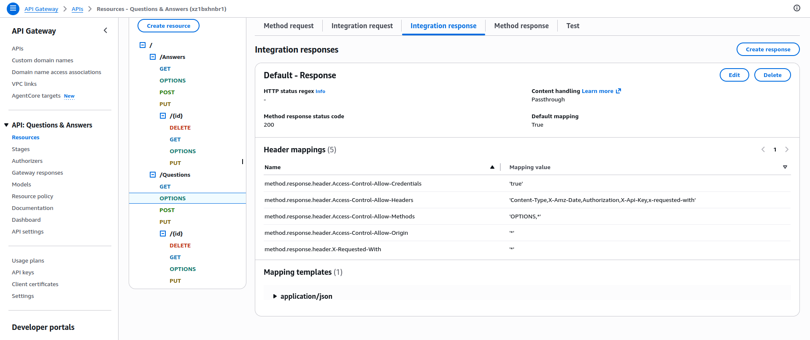
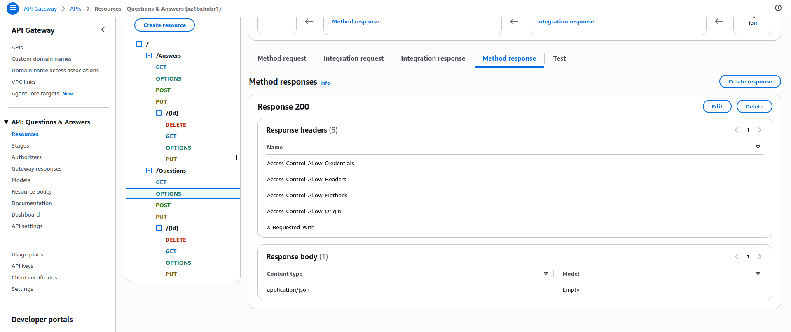

# Conclusion
At the end of this project I had a working cloud based website that allowed for user interaction with the database. This porting to the cloud made the website much more scalable, secure, and cheaper to maintain since now costs would be tied to usage rather than maintenance of servers.

After deploying the website I created a presentation going over the different aspects of this project.

[powerpoint link](SNHU-AWS-Final-Project/Project-Two-Conference-Presentation_Cloud-Development.pptx)

The biggest challenge of this project was getting the initial local website to work. There were many Node packages at play that would required troubleshooting since the initial project was based on old versions and different environments than my PC. This has shown me how containerization could help with development when sharing projects with different developers. All of it was also much easier to manage once it was setup in the cloud.
